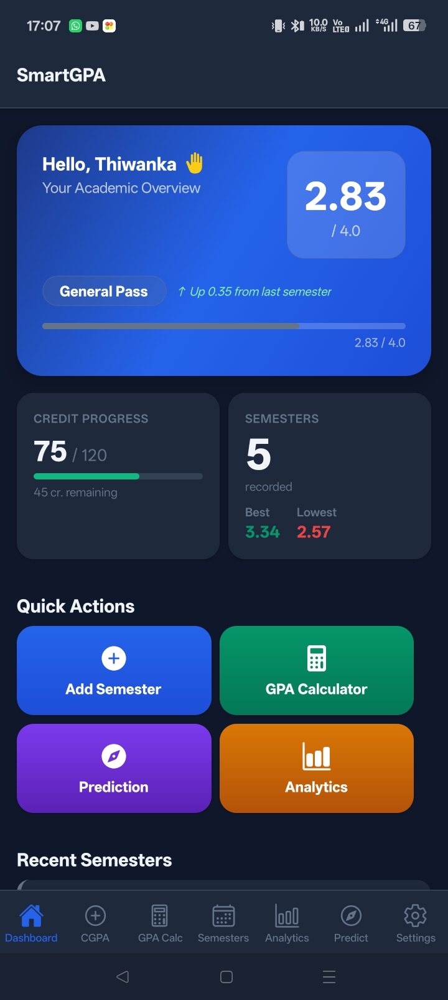
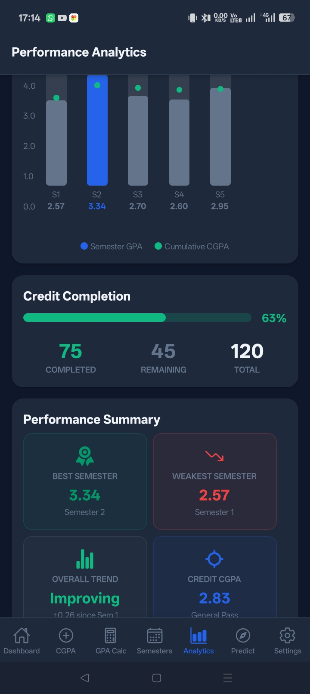
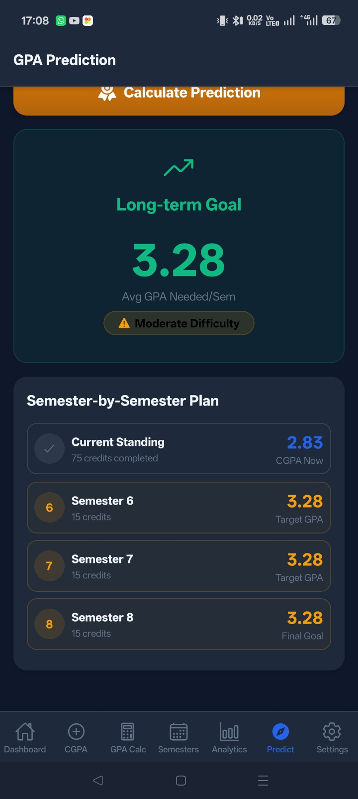

<div align="center">
  
  # 🎓 SmartGPA
  **Your Ultimate GPA & CGPA Companion**
  
  [](https://reactnative.dev/)
  [](https://expo.dev/)
  [](LICENSE)

  <p align="center">
    A comprehensive mobile application to track, calculate, and predict your academic performance with beautiful analytics.
  </p>

</div>

---

## 📖 About The Project

**SmartGPA** is designed to solve a common problem among university students: manually tracking grades and trying to guess what scores are needed to maintain a good GPA. 

Whether you're trying to figure out if you can safely drop a class, aiming for the Dean's List, or just trying to stay organized, SmartGPA acts as your personal academic assistant. By giving you an interactive dashboard, precise CGPA/GPA calculators, and goal prediction tools, you can take control of your academic journey without the hassle of complex spreadsheets.

## ✨ Features

- 🏠 **Dashboard**: Get a quick overview of your academic standing at a glance.
- 🧮 **GPA & CGPA Calculator**: Accurately calculate your semester GPA and overall CGPA.
- 📅 **Semester Management**: Organize your courses, grades, and credits semester by semester.
- 📊 **Performance Analytics**: Visualize your academic journey with insightful charts and graphs.
- 🔮 **GPA Prediction**: Set goals and predict the grades needed to reach your target CGPA.
- 🌗 **Dark/Light Mode**: Beautiful UI that seamlessly adapts to your system preferences.
- ⚙️ **Customizable Settings**: Tailor the app experience to your university's specific grading system.

## 🚀 Tech Stack

- **Framework**: [React Native](https://reactnative.dev/)
- **Toolchain**: [Expo](https://expo.dev/)
- **Navigation**: [React Navigation (Bottom Tabs)](https://reactnavigation.org/)
- **Storage**: [AsyncStorage](https://react-native-async-storage.github.io/async-storage/)
- **Styling**: Custom context-based theme engine with SafeArea support

## 📱 Screenshots

<p align="center">
  
  
  
</p>

## 🛠️ Installation & Setup

1. **Clone the repository:**
   ```bash
   git clone https://github.com/yourusername/smartgpa.git
   cd SmartGpamobile
   ```

2. **Install dependencies:**
   Make sure you have Node.js installed, then run:
   ```bash
   npm install
   ```

3. **Start the application:**
   ```bash
   npm start
   ```

4. **Run on Device/Emulator:**
   - Scan the QR code with the **Expo Go** app on your physical device.
   - Or press `a` to run on an Android emulator.
   - Or press `i` to run on an iOS simulator.

## 🤝 Contributing

Contributions, issues, and feature requests are always welcome!

1. Fork the Project
2. Create your Feature Branch (`git checkout -b feature/AmazingFeature`)
3. Commit your Changes (`git commit -m 'Add some AmazingFeature'`)
4. Push to the Branch (`git push origin feature/AmazingFeature`)
5. Open a Pull Request

## 📄 License

Distributed under the MIT License. See `LICENSE` for more information.

---
<div align="center">
  Made with ❤️ for students
</div>
